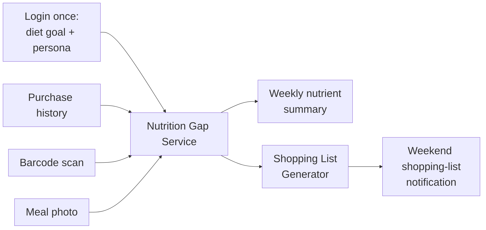
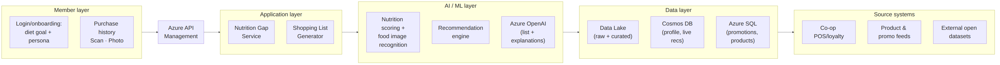

# Co-op Nutrition Intelligence

A personalisation layer on Co-op's existing loyalty data that nudges members toward healthier purchases — without becoming a clinical/medical product.

## Business problem

Co-op wants to increase customer retention and shopping frequency while supporting the "healthier purchasing decisions" pillar of its Co-op Food strategy — without the product being read as clinical or medical advice.

## Solution

Turn purchase history, barcode scans, and meal photos into:

1. **Nutrition gap analysis** — what's missing/excess based on everything a member has logged.
2. **Weekly nutrient consumption summary** — a rollup of the week's intake.
3. **Weekend shopping-list notification** — AI-generated list blending the gap with live promotions.

Persona (chronic condition / fitness / children / elderly) is set once by the member at login/onboarding and used as a filter throughout — it is not a separate inferred service. There is no food–medication interaction feature (dropped, to stay clear of "clinical product" territory).

## Inputs and outputs

| Inputs | Outputs |
|---|---|
| Login: diet goal + persona (set once, editable) | Product brief (carbs, fibre, fat, calories, additives) |
| Membership purchase history | Weekly nutrient consumption summary |
| Barcode scan (in-store or elsewhere) | Weekend shopping-list notification |
| Meal photo (restaurant/brand + food recognition) | "Why this swap" explanation |

## Architecture

**How it works (member's view):**



**Technical architecture (layered, left to right):**



Both images are in `docs/diagrams/` — add that folder to your repo alongside this README so they render. (Rendered as PNGs rather than a raw Mermaid block, so they display cleanly wherever you view the file, not only on GitHub.)

**Cross-cutting:** Microsoft Entra ID (auth) · Key Vault (secrets) · Defender for Cloud · Monitor + Application Insights.

**Changes from v1:** the Segment/Persona Service and Food-Medication Interaction Service are removed as standalone microservices. Persona is now a login-time profile attribute (stored in Cosmos DB, read by both remaining services) rather than an inferred/live service. All three inputs (purchase history, scan, photo) converge into one pipeline feeding the Nutrition Gap Service, which drives both outputs. A **food image recognition model** is now an explicit AI-layer component (needed to turn a meal photo into estimated macros). Churn/segmentation ML models from v1 are decoupled from this member-facing loop — they'd belong to a separate retention-analytics track, not the MVP.

## Data sources (open, free — no Dunnhumby / Instacart)

| Dataset | What it gives you | Freshness | License/access |
|---|---|---|---|
| [Tesco Grocery 1.0](https://www.nature.com/articles/s41597-020-0397-7) (data: [Figshare](https://figshare.com/collections/Tesco_Grocery_1_0/4769354/2)) | ~420M real UK basket-level purchases linked to nutrition, aggregated at **census-area level** (no individual/household demographics — not personal data). Closest analogue to Co-op's own transaction data for prototyping | Published 2020, static | Paper is open access; actual data files are on the Figshare collection (not the paper itself) — check that page for any download terms |
| [Open Food Facts](https://world.openfoodfacts.org/data) | Crowdsourced global barcode/product/nutrition database (what Yuka is built on) — bulk CSV export + free API | Continuously updated, no fixed release | Open Database License (ODbL) |
| [CoFID](https://www.gov.uk/government/publications/composition-of-foods-integrated-dataset-cofid) — McCance & Widdowson's Composition of Foods | UK government's authoritative nutrient reference values — best "ground truth" for UK products | Core edition still 2021 (7th); incremental scientific reviews ongoing (e.g. meat values under review, late 2024) | Free download, UK Open Government Licence |
| [USDA FoodData Central](https://fdc.nal.usda.gov/) | Large open nutrient database, fills gaps CoFID/OFF don't cover | Actively updated — v15.1 (21 May 2026, monthly branded-food update), v15.0 (30 Apr 2026, new Foundation Foods) | Free, public domain |
| [Nutrition5k](https://github.com/google-research-datasets/Nutrition5k) (Google Research) | ~5,000 food photos with measured macros/calories — trains the meal-photo recognition model | Published 2021, static | Free, open research dataset |

**Note on nutrient databases vs. dietary guidelines:** these datasets record nutrient *content* (e.g. grams of carb per 100g of food), which doesn't change when clinical guidance changes. What *is* shifting is dietary *guidance* — recent expert consensus (2023–2025) increasingly endorses lower-carbohydrate approaches for type 2 diabetes glycaemic control. That target belongs in the Nutrition Gap Service as a configurable threshold (sourced from current NICE/Diabetes UK guidance), not in the food database itself.

**Membership data:** not available yet — prototype entirely on the open datasets above until Co-op grants access/approval.

## On "linking external data without storage cost"

Partly true, with a caveat. You can query external data on-demand (e.g. Synapse serverless SQL querying files directly in a data lake, or calling the Open Food Facts API live) instead of bulk-copying the whole dataset into your own storage — that avoids storage and refresh-pipeline costs for large third-party datasets you don't own. It does **not** remove compute or API-call costs, and it isn't a valid pattern for Co-op's own member/transaction data, which must sit in your own governed storage (Cosmos DB/Azure SQL) for security and compliance regardless.

## Suggested repo structure

```
/docs                  — this proposal, architecture decisions
/docs/diagrams         — overview.png, technical-architecture.png
/00-data               — downloaded open datasets (see below), not committed if large — .gitignore raw files, keep only download scripts
  /tesco-grocery-1.0
  /open-food-facts
  /cofid
  /usda-fdc
  /nutrition5k
/functions             — Azure Functions (per microservice)
/data-pipeline         — Data Factory/Synapse pipeline definitions
/ml                    — Azure ML model training/scoring code
/infra                 — Bicep/Terraform for Azure resources
```

Note on `/00-data`: some of these datasets are large (Tesco Grocery 1.0 especially). Best practice is to keep the raw files out of git entirely (add `/00-data/**/*.csv` etc. to `.gitignore`) and only commit small download/setup scripts — otherwise the repo gets slow and GitHub has file-size limits.
